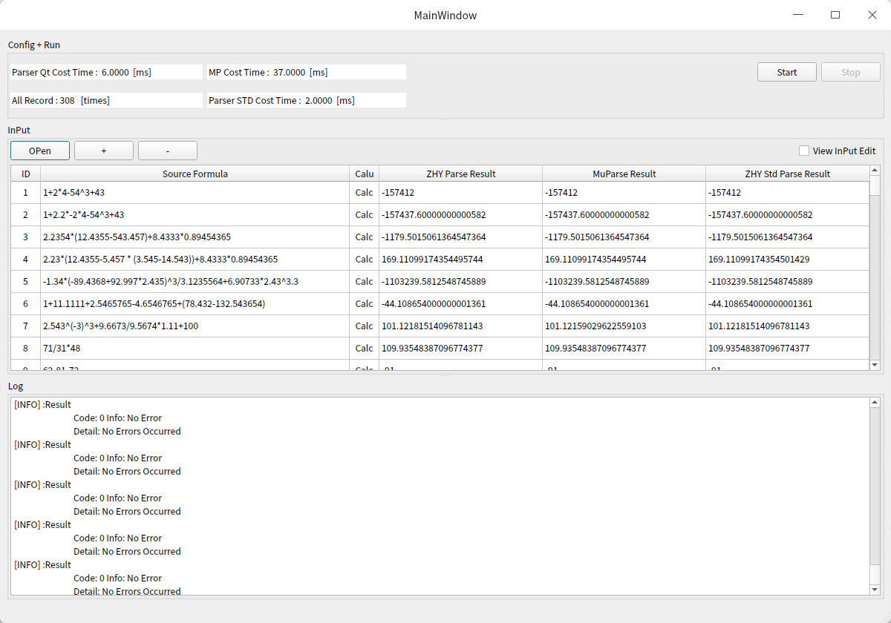

# easy-math-parser

A simple toolkit written by C++ to support the calculation of four operational strings. Inspired by [Muparser](https://beltoforion.de/en/muparser/features.php#idStart).

In this gadget, I have implemented a simpler and more efficient parser. Four operations are supported: addition, subtraction, multiplication and division, and exponentiation. Of course, you can also extend other binary operators, such as logarithm. 
For the first time, the tool is also an expression that supports parenthesis precedence.



## 1. Code Structure Description

- root folder
  - common
  - muparser_engine
  - parser_qt : toolkit written by qt5.
  - parser_std : toolkit written by c++ stdand.
  - muparser_engine : Muparser library test api.
  - gui_test : use gui to test the toolkit.
  - test_data : some test data.
  - main.cpp

## 2. Sample Usage

Use the **easy_parser_qt** like follow:

```c_cpp
// 1. include the header
#include <parser_qt/easy_parser_qt.h>

// 2. init the error info item. this is optional.
ERRORINFO_ST info = EasyParserQt::E000;

// 3. eval the math formula result.
double zhy_res = EasyParserQt::eval("1+2.2*-2*4-54^3+43", info);
```

<br/>

Use the **easy_parser_std** like follow:

```c_cpp
// 1. include the header
#include <parser_qt/easy_parser_std.h>

// 2. init the error info item. this is optional.
ZHYSTD::ERRORINFO_ST zhy_info = ZHYSTD::EasyParserStd::E000;

// 3. eval the math formula result.
double zhy_res = ZHYSTD::EasyParserStd::eval("1+2.2*-2*4-54^3+43", info);
```

## 3.Parser Support

In this toolbox, the string is divided into two valid morphemes, one is the Operand and the other is the operator. 
Operands are valid numeric types, numbers that support ordinary numeric representation and scientific numeration. 
Operators support five types of symbols and support parentheses as precedence calculators.

### 1. Operand

In this toolkit, To speed up processing, operands are double-precision floating-point types, that is, double types, and do not do the work of distinguishing between integers and floating-point numbers.

### 2. Operator

|Operator|Function|Explain|Level|
|:--:|:--:|:--:|:--:|
|+|addition|addition two number|0|
|-|subtraction|subtraction two number|0|
|*|multiplication|multiplication two number|1|
|/|division|division two number|1|
|^|exponentiation|exponentiation two number|2|

### 3. Parenthesis

|Operator|Function|Explain|Level|
|:--:|:--:|:--:|:--:|
|( )|Parenthesis|The operations are limited to calculate the data in parentheses|3|
